+++
date = 2024-09-25T11:26:00+00:00
draft = false
title = "Pen Review #3: Kaweco Brass Sport <EF> - Get This Pen just for The Patina"
tags = ["fountain-pen", "fountain-pen/review"]
cover = "image-01.jpg"
+++

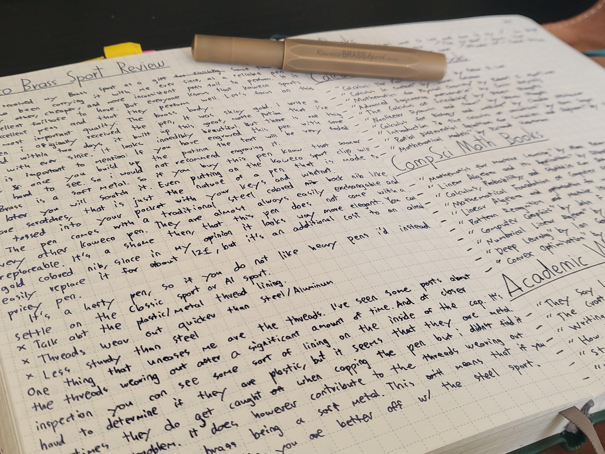

I have received my Brass Sport as a gift some time ago, and i have been carrying it with me ever since, it's a good, reliable EDC pen in case my other, cheaper, and more inconsistent pens fail to perform. It is an excellent fail safe to have. But everyone knows that Kaweco Sports are excellent pens and that they perform well. Let's focus on this pen's most important quality: The Brass Body.

When I originally received the pen, it was shiny gold. I write a lot, and within two days it built up this matte patina that I've been with ever since. It looks beautiful. But there are two things that are important to mention: firstly, the engraving on the pen is very faded and barely visible. Secondly, once the patina settles in, it is hard to remove. It is doable with the right tools, but it scratches the pen. Over time the patina will also darken, and in a dozen or so years, the pen will likely turn black.

Brass is a soft metal. If you buy this pen know that sooner or later you will scratch it. Even putting on the Kaweco Sport Clip will leave scratches, that is just the nature of a pen that is made to be tossed into your pocket with your keys and whatnot. The pen comes with a traditional steel coloured bock nib like every other Kaweco pen. They are almost always easily exchangeable and replaceable. It's a shame that the pen does not come with a gold coloured nib, since in my opinion it looks way more elegant. You can easily replace it for about 12$, but it's an additional cost to an already pricey pen. It's also a hefty pen, so if you do not like heavy pens I'd instead settle on the classic sport or AL Sport. It is also marginally heavier than the steel sport, but the difference is so small I could not notice the weight difference at all.

One thing that slightly alarms me are the threads. I've seen some posts about the threads wearing out after a certain amount of time. And at closer inspection you can see some sort of lining on the inside of the cap. It's hard to determine if they are plastic. Sometimes they do get caught when capping the pen but I didn't find it to be a problem. It does however contribute to the threads wearing out quicker. This means that if you want a more sturdy option, you are better off with the Steel Sport.

Overall I would go with this pen only if you really want brass. If you want all the quirks that brass offers you will love this pen; otherwise settle for an AL Sport for a lighter option or steel sport for a sturdier one.

# Photos
- Writing Sample With Diamine Midnight
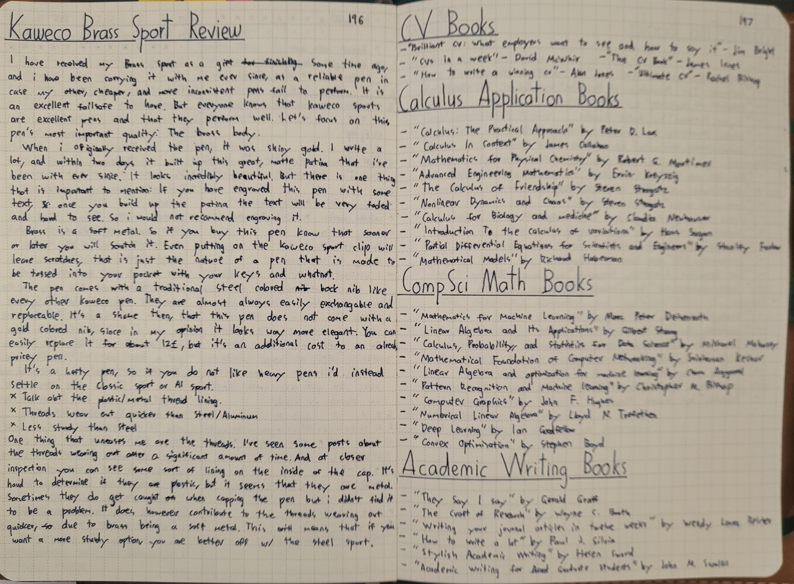

- Pen comparison with Lamy Safari and Kaweco Liliput
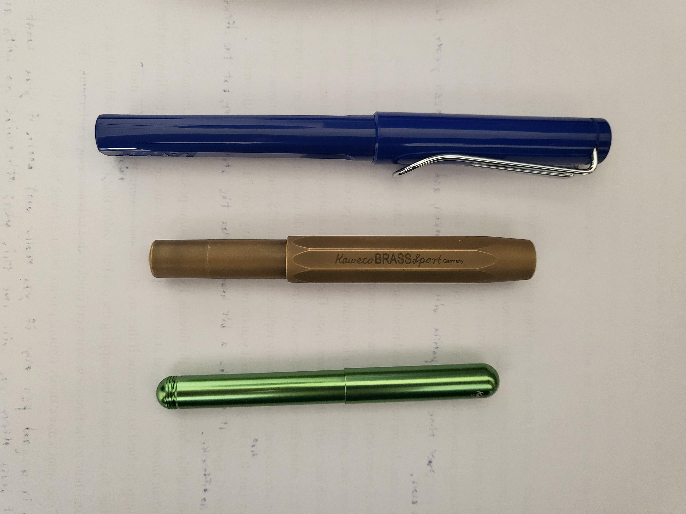

- Pen uncapped and posted
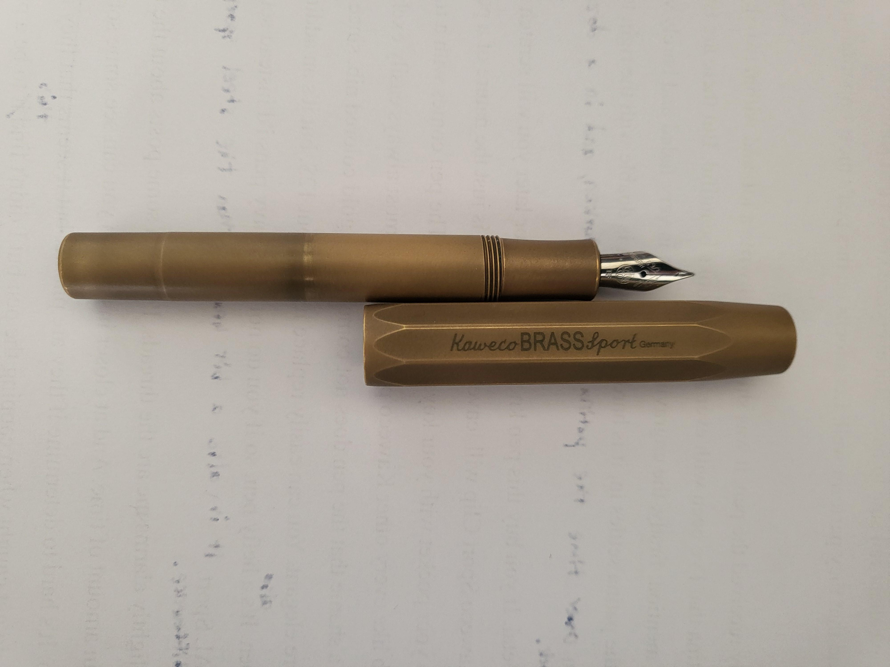

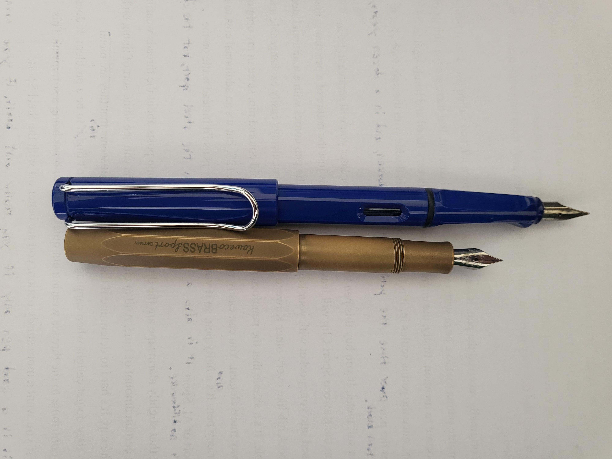

- Pen in Hand
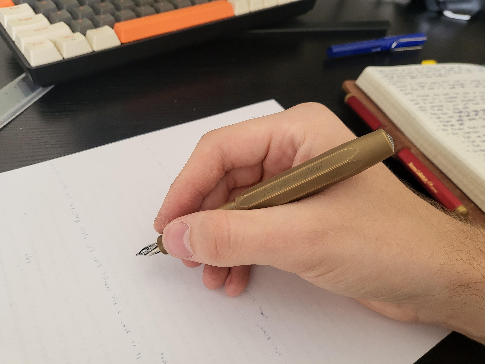

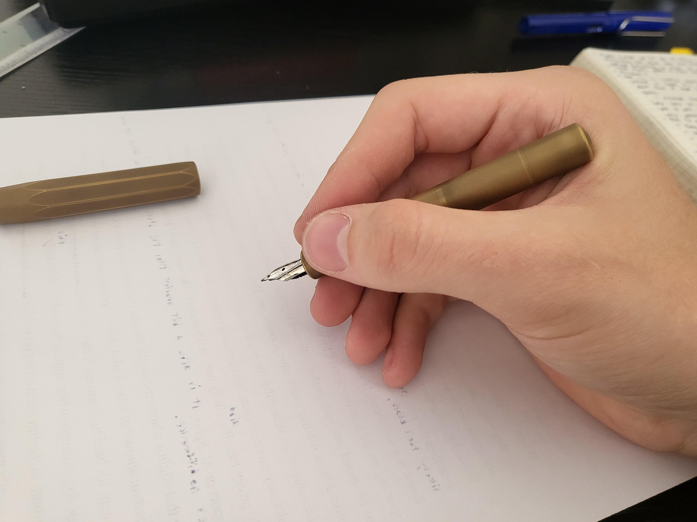

- The Nib
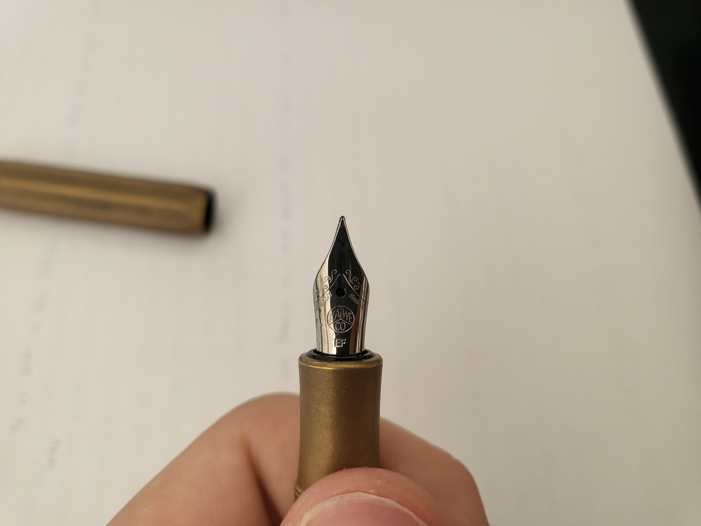

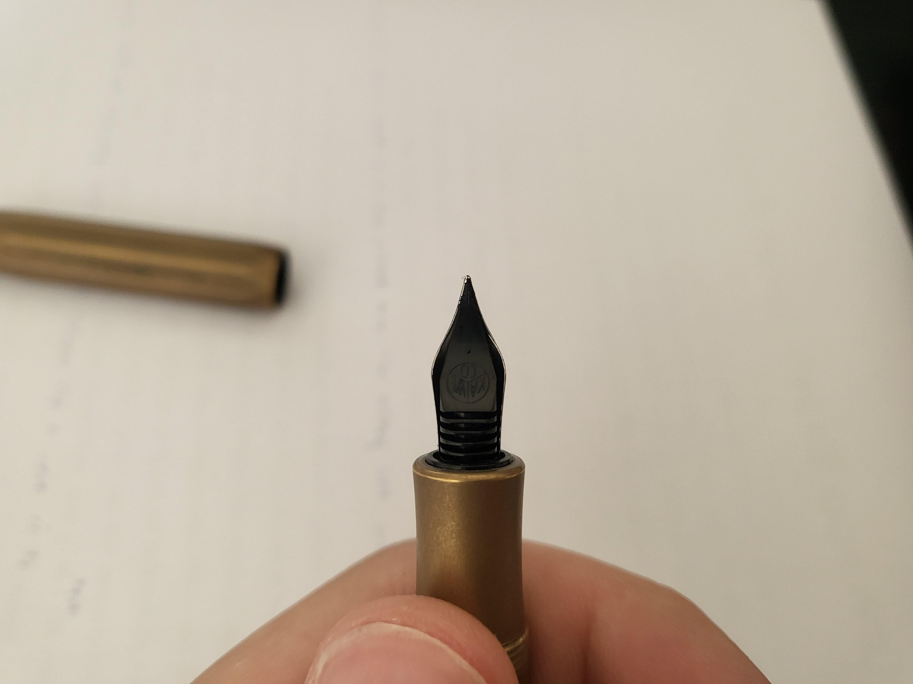

- The unique patina build up
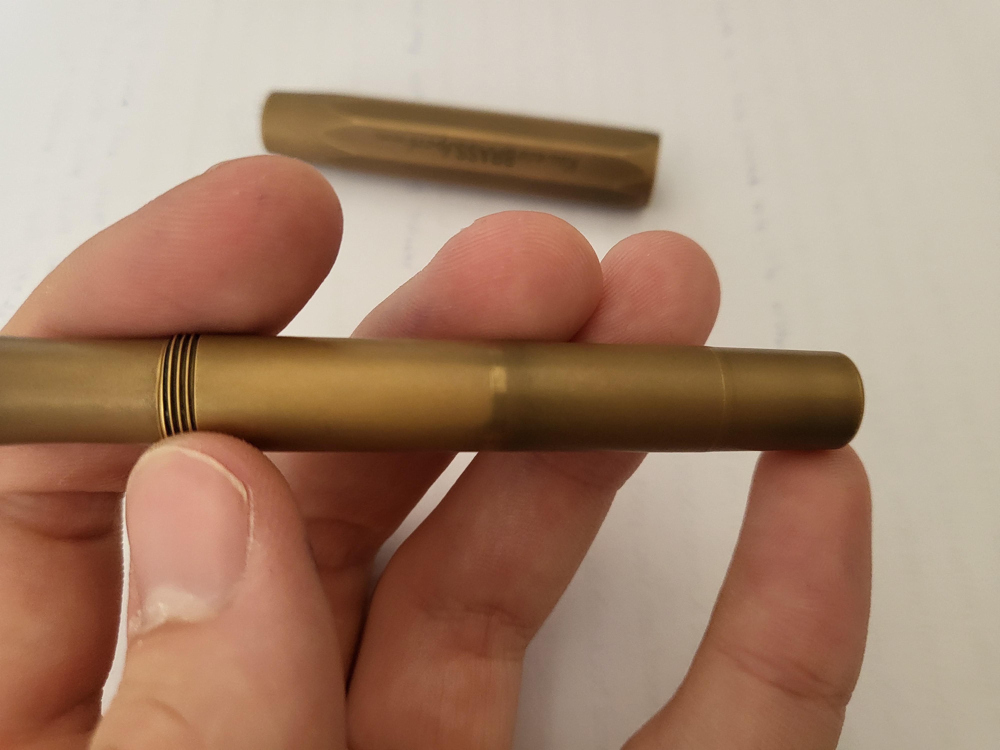

- The weird threads inside the cap.
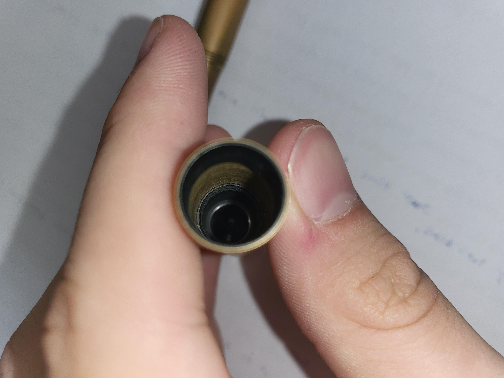
