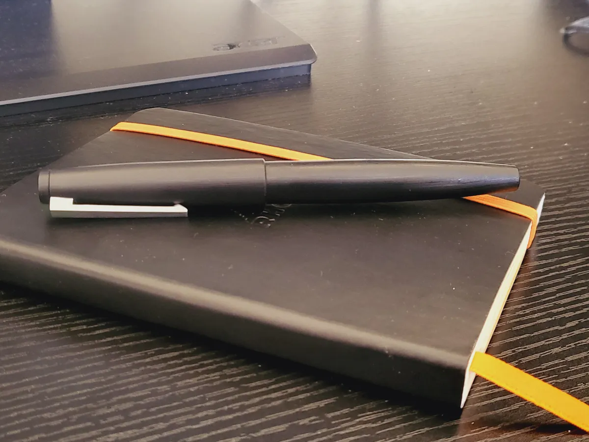
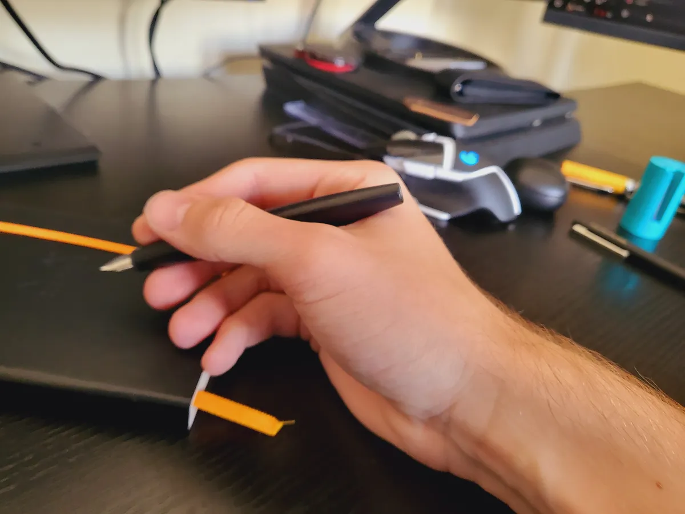
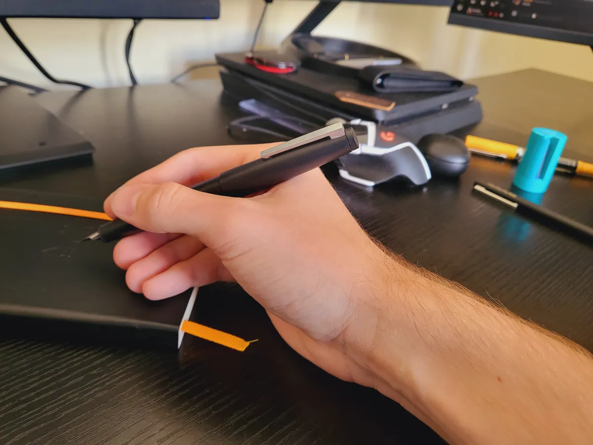
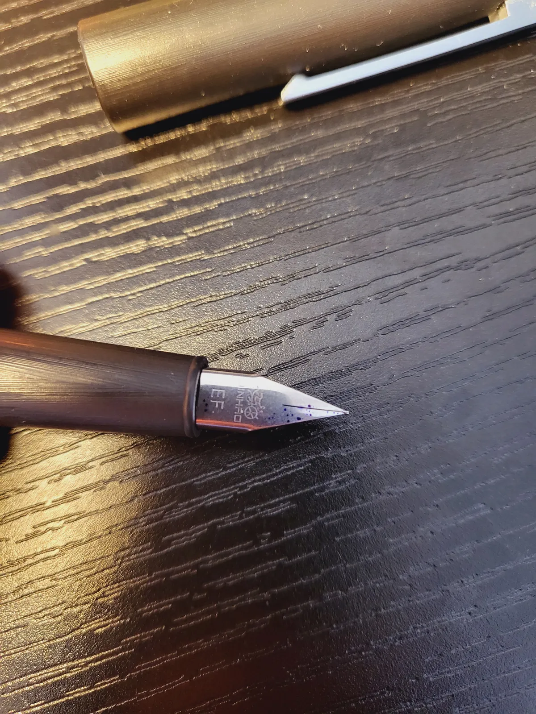
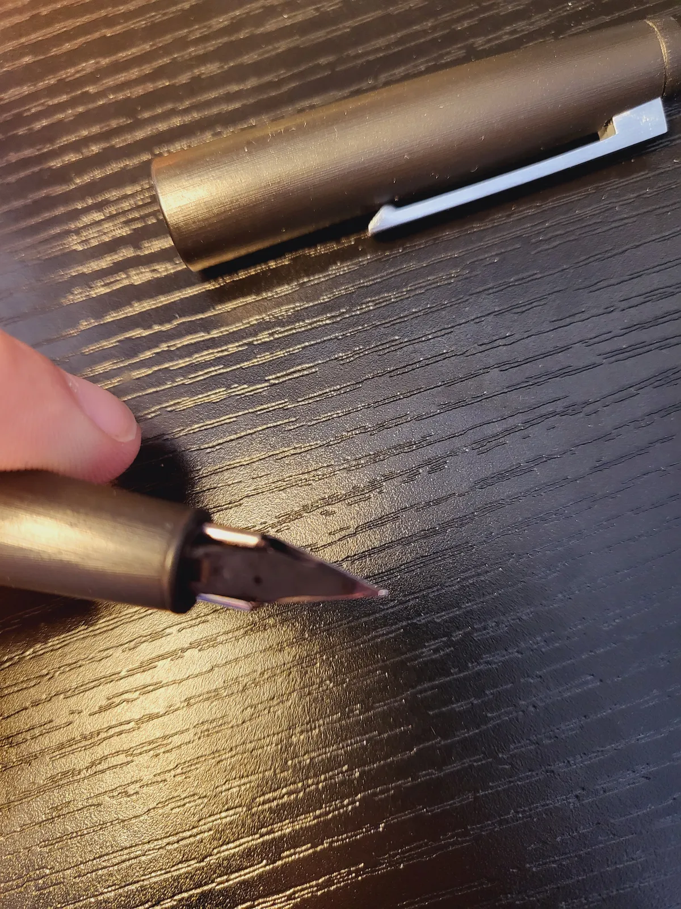
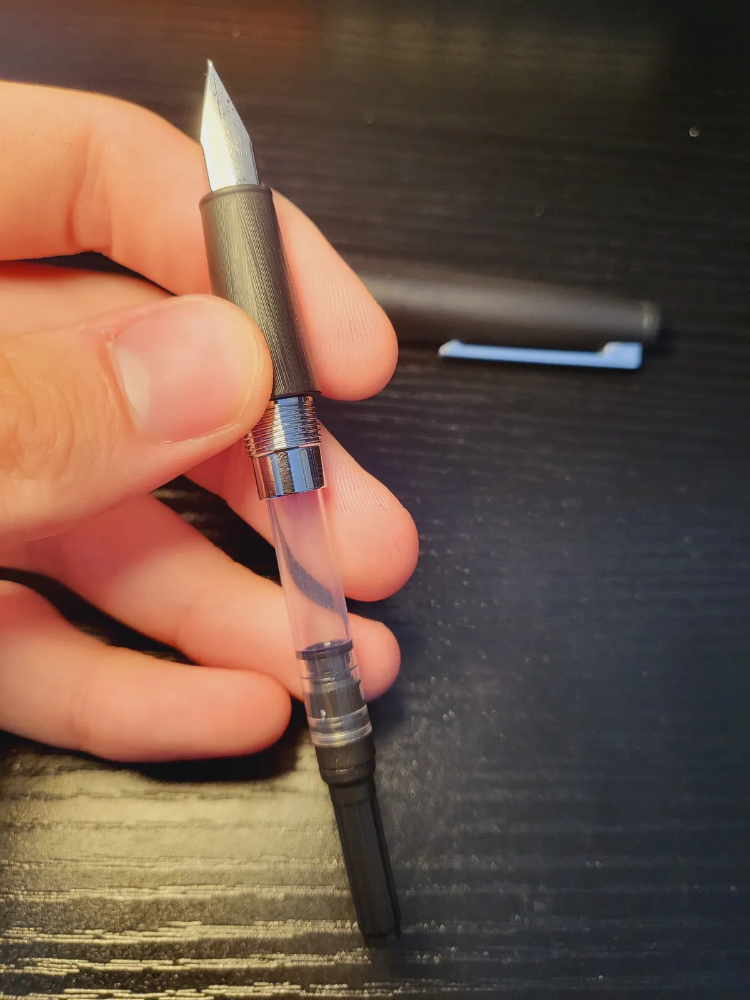
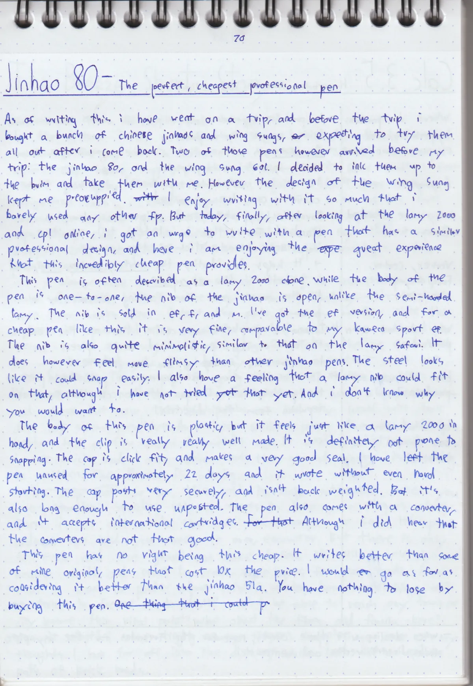

+++
date = 2024-10-10T14:52:00+00:00
draft = false
title = "Pen Review #4: Jinhao 80 <EF> - The cheapest professional pen"
tags = ["fountain-pen", "fountain-pen/review"]
cover = "image-01.webp"
+++

Before a recent trip, I purchased several Jinhaos, excited to try them all out. One pen, the Jinhao 80, arrived before the trip, I inked it up and brought it along. And today, after viewing the Lamy 2000 and CP1 online, I was drawn to the Jinhaos professional aesthetic. Despite the low price, I'm enjoying this great writing experience that this outrageously cheap pen provides.

The pen is often described as a Lamy 2000 clone. The body is plastic, but it feels just like a Lamy 2000, and the clip is real well made and it is a spring clip. The cap is click fit, and makes a very good seal. I have left the pen unused for about 22 days and it wrote without even hard starting. It posts vey securely, and isn't back weighted. But it's also long enough to use unposted. The pen comes with a converter, and **does not accept international cartridges**, which I have learned the hard way.

While the body of the pen is one-to-one, the nib of the Jinhao is open, unlike the semi-hooded Lamy. The nib is sold in EF, F, and M. I've got the EF version, and for a cheap pen like this it is very fine, thinner than my Kaweco Sport EF. The nib is minimalistic, similar to that on the Lamy safari. But it feels more flimsy than other Jinhao pens I have. It looks like it could snap easily.

This pen has no right being this cheap. It writes better than some of my original pens that cost ten times the price. The nib is more flimsy than other Jinhaos, but this pen accepts Lamy nibs, and if you really want to make this pen great you could buy a Lamy nib and put it in this Jinhao. You have nothing to lose by buying this pen.

## Photos

- The ink is Diamine Sapphire

