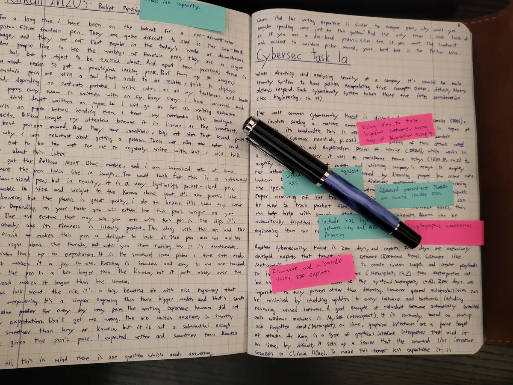
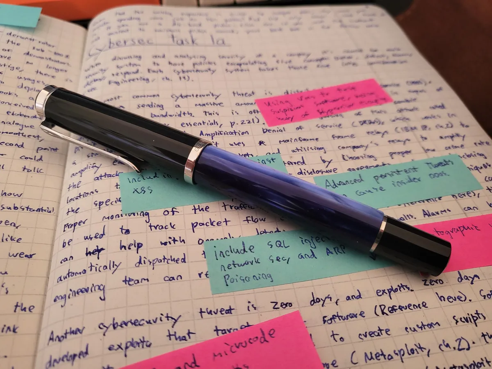
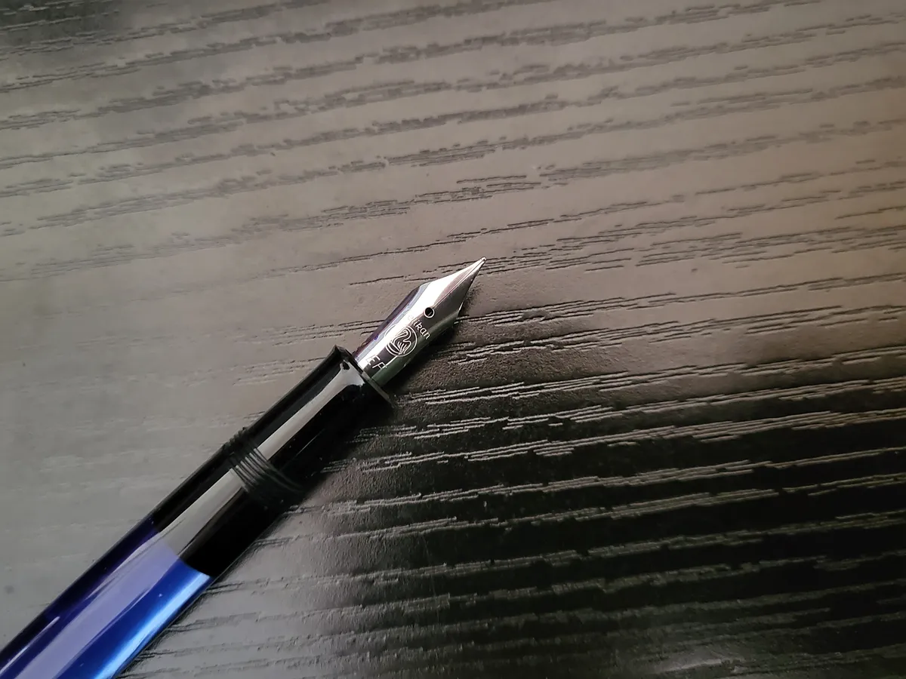
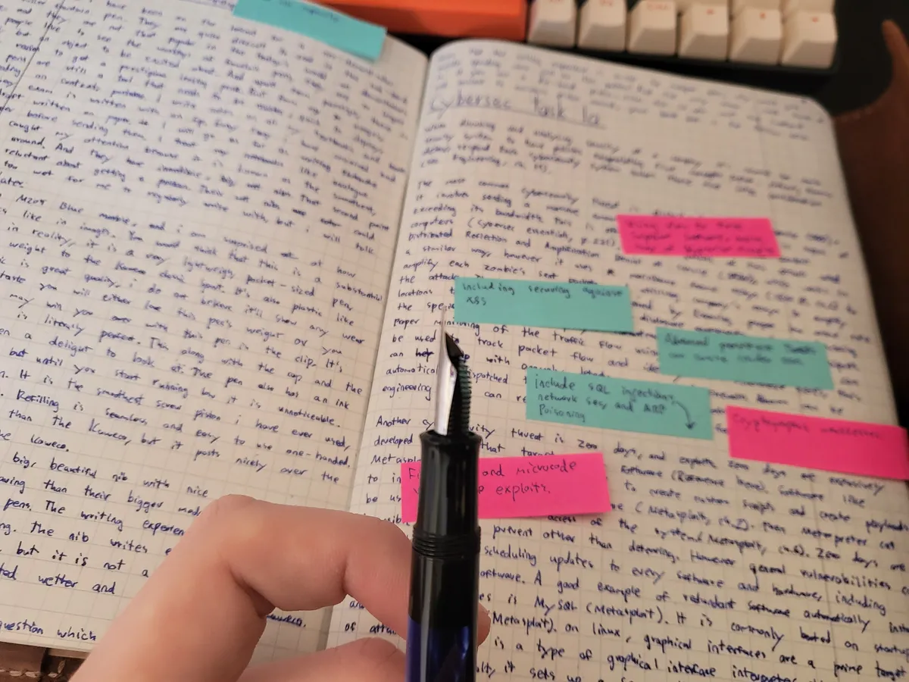
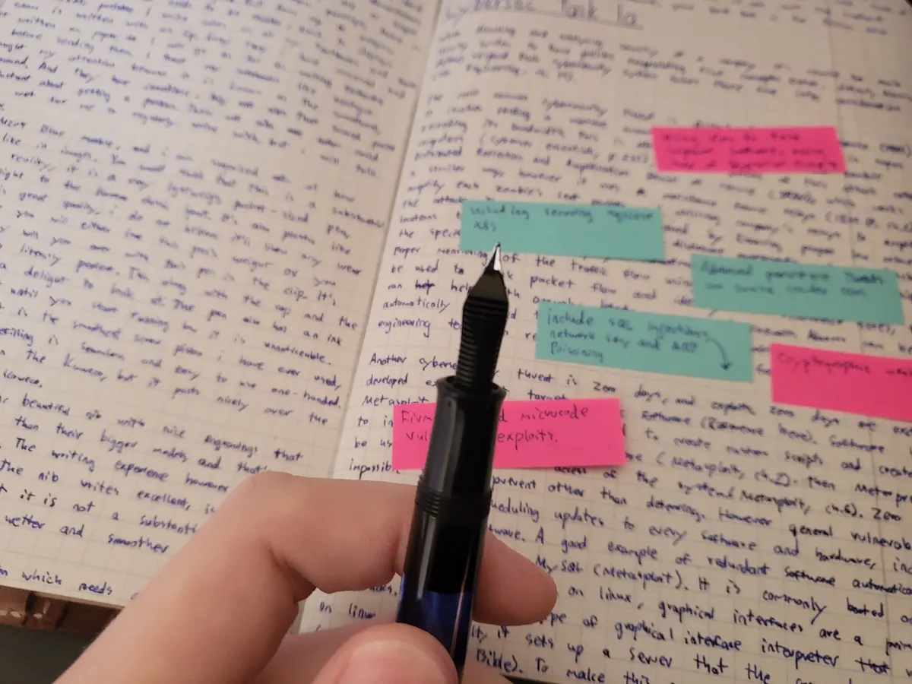
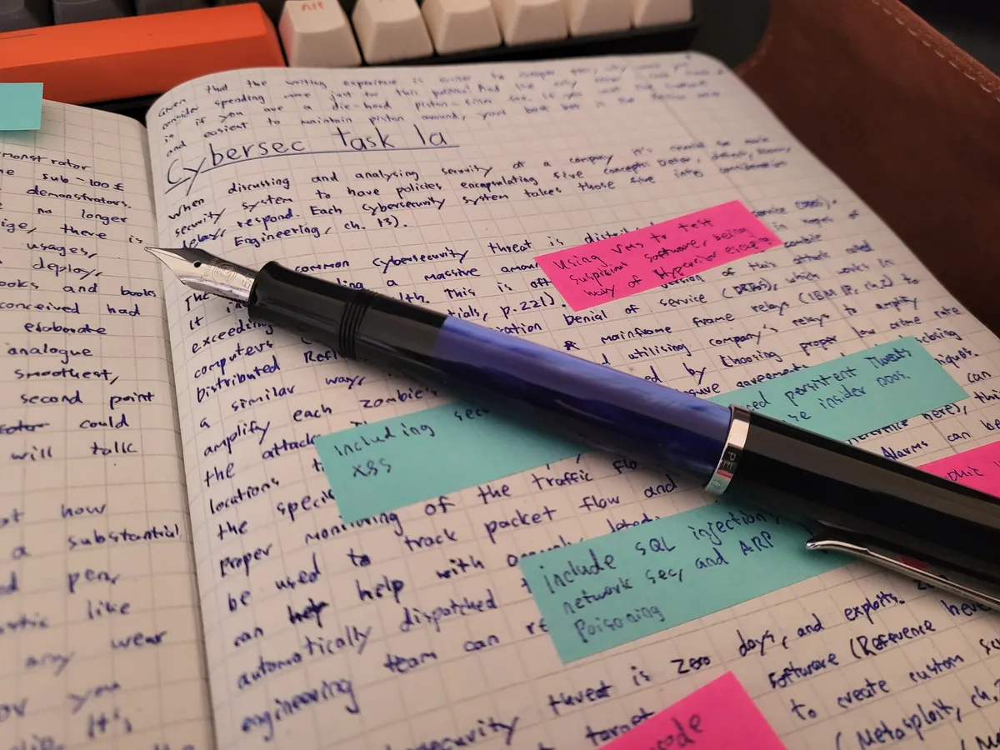
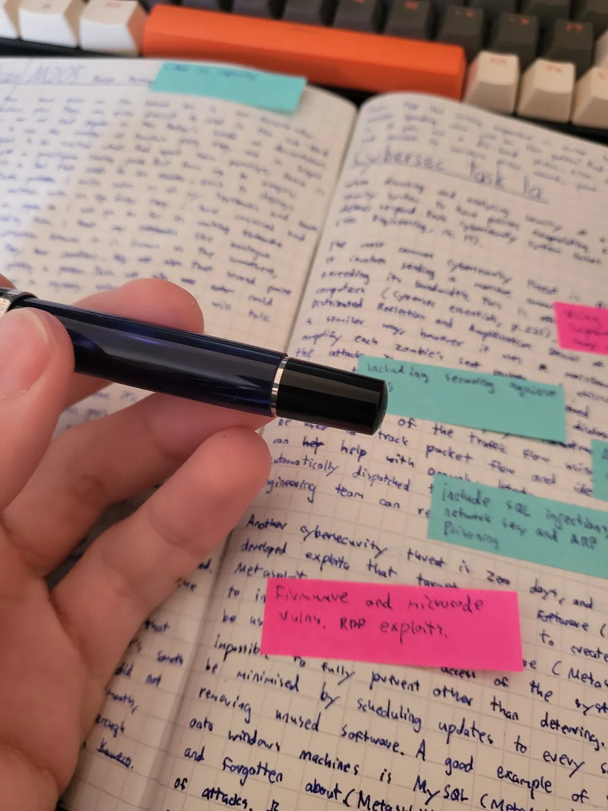
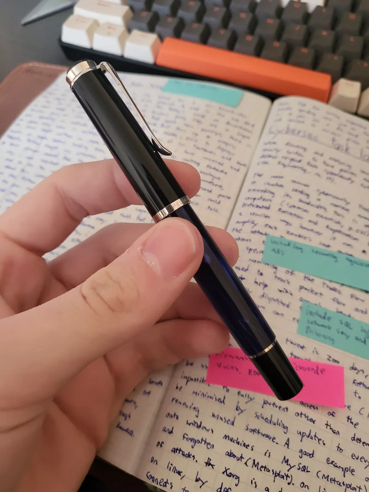
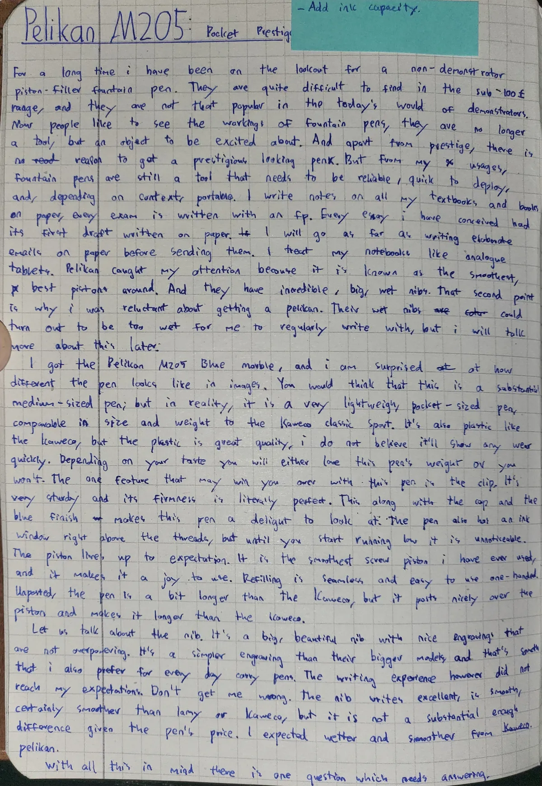

+++
date = 2024-12-14T12:59:00+00:00
draft = false
title = "Pen Review #7: Pelikan M205 <EF> - The Best Piston Filler... and that's it."
tags = ["fountain-pen", "fountain-pen/review"]
cover = "image-01.webp"
+++

I've been on the lookout for a non-demonstrator piston-filler fountain pen for a long time. I love the classic, elegant look of traditional fountain pens. While I do enjoy writing with demonstrators occasionally, I'm definitely more drawn to the timeless style of traditional designs. They're not easy to find in the sub-$200 range, and they're not as popular these days with all the flashy demonstrators around. People now like to see the inner workings of fountain pens, which adds to their visual appeal. The transparency lets users admire the mechanism in action. Historically, demonstrators were used by pen makers to show potential buyers the internal workings of fountain pens, demonstrating their quality and craftsmanship. Fountain pens are no longer just tools; they're objects of excitement. Apart from prestige, there's really no reason to get a fancy-looking pen. But for me, fountain pens are still tools—they need to be reliable, quick to use, and portable when needed. I write notes in my textbooks and paperbacks, every exam I take is written with a fountain pen, and every essay I've drafted started on paper. I'll even write elaborate emails on paper before typing them up. I treat my notebooks like analog tablets.

Pelikan caught my attention because it's known for having the smoothest, best pistons around. Compared to other brands like TWSBI or Lamy, Pelikan's piston mechanism feels significantly smoother and more refined, making it stand out among piston fillers. The higher price also means you're getting a quality product where no corners are cut—something that isn't always the case with brands like TWSBI. Pelikan pens also have big, wet nibs, which made me a bit hesitant at first. Their nibs can be too wet for my everyday writing, but more on that later.

I got the Pelikan M205 Blue Marble, and I was surprised at how different it looks compared to the images. It's smaller and feels much lighter than I expected. The blue marble finish is also less matte and more pronounced—almost overpowering at first, but not in a bad way. The piston knob is threaded, which provides a solid grip and makes it easy to use one-handed. You'd think it's a substantial, medium-sized pen, but in reality, it's a very lightweight, pocket-sized pen, comparable in size and weight to Kaweco's plastic Sport models. It's plastic, just like the Kaweco, but the plastic is great quality—it has a thick, sturdy feel with a smooth, well-finished surface that I don't think will show wear anytime soon. Depending on your preference, you'll either love this pen's lightness or not. One feature that might win you over is the clip. It's very sturdy, with just the right firmness. It's bent just right to make it easy to attach to pockets or notebooks, and it has an attractive look too. It's incomparable to Kaweco's modular clips or Lamy's minimalistic ones. Along with the cap and the blue finish, this pen is a delight to look at. The pen also has an ink window just above the threads, but you barely notice it until the ink runs low.

The piston mechanism lives up to expectations. It's the smoothest piston I've ever used, making it a joy to refill. However, the ink capacity of the Pelikan M205 is 1.25ml, which is less than most TWSBI pens and only slightly more than a standard international cartridge. This might be a deal-breaker for those who prioritize larger ink capacities. Compared to TWSBI's mechanism, which feels flimsy, non-locking, and stiff to turn, the Pelikan piston is far superior. Wing Sung's piston is also unintuitive due to its locking mechanism and is just as stiff as TWSBI's. The Pelikan mechanism, on the other hand, is smooth, reliable, and easy to operate. Refilling is seamless and easy to do one-handed. Unposted, the pen is just a bit longer than the Kaweco, but it posts nicely over the piston, making it longer and more comfortable to use.

Now, let's talk about the nib. It's a big, beautiful nib with nice engravings that aren't too flashy. It's simpler than the engravings on Pelikan's bigger models, which I prefer for an everyday carry pen. The writing experience, though, didn't quite meet my expectations. Don't get me wrong—the nib writes great and is certainly smoother than other German nibs I've used, like those from Lamy and Kaweco. But the difference isn't substantial enough considering the price. I expected wetter and smoother from Pelikan.

So, with all this in mind, there's one big question: Given that the writing experience is similar to cheaper pens, why spend more on this Pelikan? The only real reason I can think of is if you're a fan of piston fillers. This is the best piston filler on the market, and I'm confident it will outperform any competitor. The Pelikan piston mechanism offers smoother operation and superior build quality, making it more reliable and enjoyable to use compared to others. If you want the smoothest, easiest-to-maintain piston out there, your best bet is the Pelikan M200. Another reason to consider this pen might be if you want a thicker nib size. If you go with Fine or Medium, Pelikan might live up to its reputation. Since I mostly use Extra Fine nibs, it's hard for me to say for sure.

## Photos

