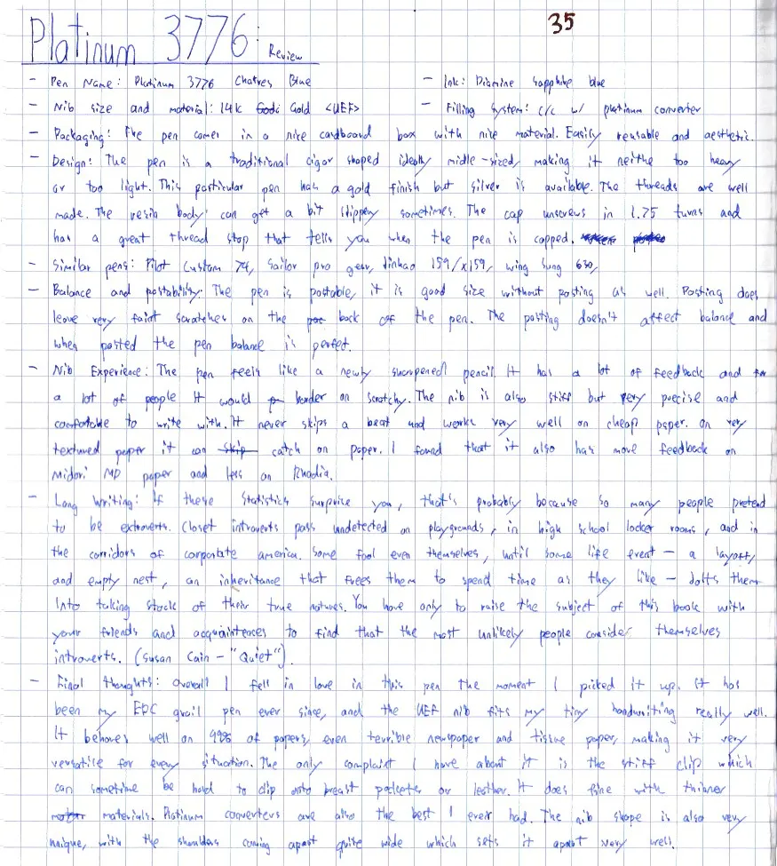
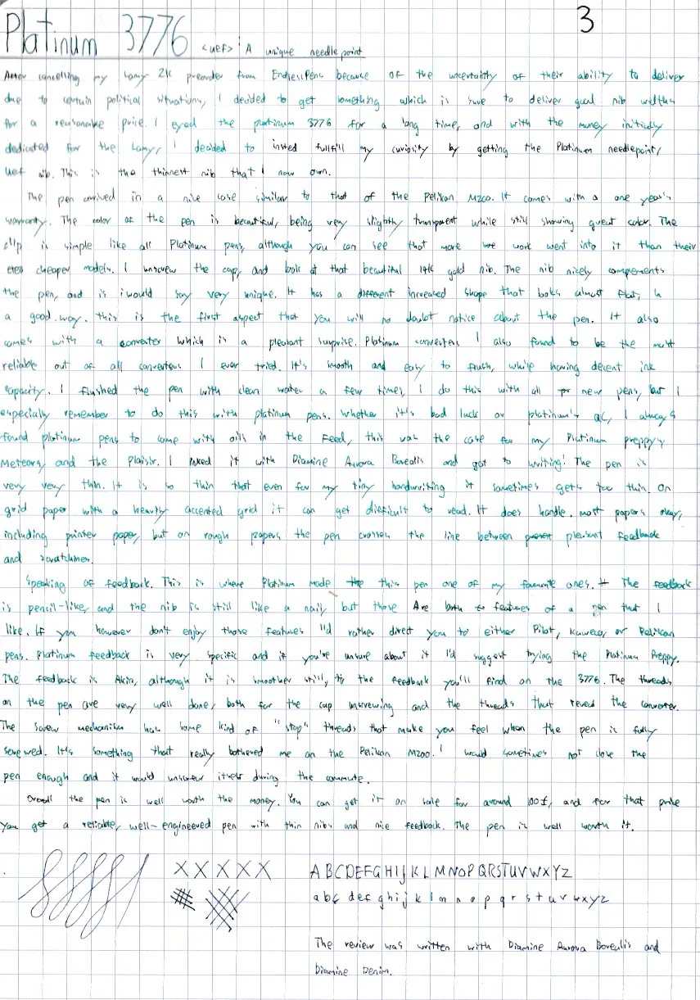

+++
date = 2025-07-02T17:16:00+00:00
draft = false
title = "Pen Review #9: Platinum 3776 <UEF>"
tags = ["fountain-pen", "fountain-pen/review"]
cover = "image-01.webp"
+++

Pen: Platinum 3776 Chartres Blue
- Nib Size and Material: 14k Gold UEF
- Ink: DIamine Sapphire Blue
- Filling System: C/C with Platinum Converter
- Packaging: The pen comes in a nice cardboard box. Easily reusable and aesthetic.
- Design: The pen is a traditional cigar-shaped ideally Middle-sized, Making it neither too heavy nor too light. This particular pen has a gold finish but silver is available. The threads are well made. The resin body can get a bit slippery sometimes. The cap unscrews in 1.75 turns and has a great thread stop that tells you when the pen is capped.
- Similar Pens: Pilot Custom 74, Sailor Pro Gear, Jinhao 159 / x159, WIng Sung 630.
- Balance and Postability: The pen is postable, it is good size without posting as well. Posting does leave very faint scratches on the back of the pen. The posting doesn't affect balance and when posted the pen balance is perfect.
- Nib Experience: The pen feels like a newly sharpened pencil. It has a lot of feedback and a lot of people would consider it scratchy. The nib is also stiff but very precise and comfortable to write with. It never skips a beat and works very well on cheap paper. On very textured paper it can catch on it. I found that it also has more feedback on Midori MD paper and less so on Rhodia.
- Long Writing: "If these statistics surprise you, that's probably because so many people pretend to be extroverts. Closet introverts pass undetected on playgrounds, in high school locker rooms, and in the corridors of corporate America. Some feel fool even themselves, until some life event - a layoff, an empty nest, an inheritance that frees them to spend timer as they like - jolts them into taking stock of their true natures. You have only to raise the subject of this book with your friends and acquaintances to find that the most unlikely people consider themselves introverts." - Susan Cain - "Quiet"
- Final Thoughts: Overall I fell in love in this pen the moment I picked it up. It has been my EDC grail pen ever since, and the UEF nib fits my tiny handwriting really well. It behaves well on 99% of papers, even terrible newspaper and tissue paper, making it very versatile for every situation. The only complaint I have about it is the stiff clip which can sometimes be hard to clip onto breast pockets or leather. It does fine with thinner materials. Platinum converters are also the best I ever had. The nib shape is also very unique, with the shoulders coming apart quite wide which sets it apart very well.
## Further Thoughts

After cancelling my Lamy 2000 pre-order from Endless Pens due to the uncertainty of their ability to deliver, given certain political situations, I decided to get something that would deliver reliably with consistent nib widths at a reasonable price. I had eyed the Platinum 3776 for a long time, and with the money initially dedicated to the Lamy, I decided instead to fulfil my curiosity by getting the Platinum Needlepoint UEF nib. This is now the thinnest nib I own.

The pen arrived in a nice case, similar to that of the Pelikan M200. It comes with a one-year warranty. The colour of the pen is beautiful—very slightly transparent while still showing great depth. The clip is simple like all Platinum pens, although you can see that more work went into it than their cheaper models. I unscrewed the cap and admired the beautiful 14K gold nib. The nib complements the pen nicely and is very unique compared to the other members of the Big Three. It has a different shape that looks almost flat—in a good way. This is the first aspect you will no doubt notice about the pen. It also comes with a converter, which is a pleasant surprise. I’ve found Platinum converters to be the most reliable out of all the converters I’ve ever tried. They’re smooth and easy to flush, while offering decent ink capacity.

I flushed the pen with clean water a few times, as I do with all new pens, but I take special care with Platinum. Whether it’s bad luck or Platinum’s QC, I always find their pens to come with oils in the feed that cause skipping. This has been the case for every Platinum Preppy and Plaisir I own. I inked it up with Diamine Aurora Borealis and later with Diamine Sapphire Blue and got to writing! The pen writes very, very thin. It is so fine that, even for my tiny handwriting, it sometimes gets too thin. On paper with strongly accented grids (like Rhodia, less so on Midori MD) it can get difficult to read. It handles most papers well, including printer paper, but on rougher papers it crosses the line between pleasant feedback and scratchiness.

Speaking of feedback, this is where Platinum made this pen one of my favourites. The feedback feels like a sharpened pencil, and the nib is quite stiff, but I see both as features I enjoy. However, if you don’t like that sensation, I’d rather direct you to Pilot, Kaweco, or Pelikan. Platinum feedback is very specific, and if you’re unsure about it, I’d suggest trying another pen first. The threads on the pen are very well done, both for the cap and the body. The screw mechanism has a sort of “stop” in the threads that lets you know the pen is fully closed. This is something that really bothers me on the Pelikan M200, where I sometimes wouldn’t close the pen enough, causing it to unscrew itself during a commute.

Overall, the pen is well worth the money. You can get it on sale for around $90–100, and for that price you get a reliable, well-engineered pen with a Japanese nib and that classic Platinum feedback.
