+++
date = 2024-09-18T09:53:00+00:00
draft = false
title = "Pen Review #2: Wing Sung 601 <F> - The Perfect Knock-Off"
tags = ["fountain-pen/review"]
cover = "image-01.jpg"
+++

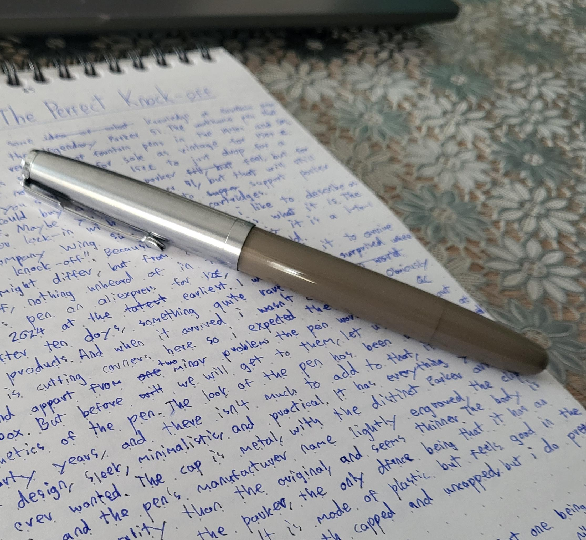

Anyone that has at least some knowledge of fountain pens has probably heard of the legendary Parker 51. The workhorse pen that revolutionized efficiency and reliability of fountain pens in the 1940s and 1950s. Some of the original pens still available for sale as vintage for 200+ dollars, still fully functional. But not everyone has 200 dollars to just drop for a fountain pen. What if you still want that Parker feel, but for less? You could buy a modern Parker 51, but that will still put you back about $100. Maybe you just don't want to support Parker due to their vendor lock-in with proprietary cartridges.  
The Chinese company Wing Sung offers what i like to describe as the "Perfect Parker knock-off", Let's not kid ourselves, this is what Wing Sung 601 is. The internal design might differ, but from the outside it is an almost one-to-one Parker.

I bought this pen on AliExpress for $18, and expected it to arrive on Christmas 2024 at the earliest. I was pleasantly surprised when it arrived after ten days, something quite rare with Chinese products; it seems like more of those companies are getting into the western market, and they are improving their quality. When it arrived i wasn't disappointed. Obviously Wing Sung is cutting corners here so i expected the pen to have Quality Control Problems. And apart from two minor problems the pen worked perfectly out of the box. But before we will get to them, let us first look at the aesthetics of the pen. The design of the pen has been well established for fifty years, and there isn't much to criticise about it.  It is almost a perfect  design, sleek, minimalistic, and practical. It has everything you could have ever wanted. The cap is metal, with the distinct Parker arrow on the clip, and the pen's manufacturer name lightly engraved on the cap. The clip does feel poorer quality than the original, and seems thinner and more flimsy, although it doesn't look like it would snap easily. The body is almost one-to-one with the Parker, the only  difference being that it has an ink window in the barrel. It is made of plastic, but feels good in the hand. It is comfortable to use both capped and uncapped, but i do prefer it capped. Don't push the cap too much into the pen though, because some ink can get smeared onto the pen. Capping the pen also does not feel nice. It's not a click or a screw-cap. It's just friction fit. Which does not bother me, but it does feel like it is being scratched when it is being capped, even though it's not. Personally I also don't like the design of the ink window, i'd prefer for it to be completely clear, rather than have those square windows.
## The Two Problems
I did mention that the pen has two problems. The first one being that the wing sung's hooded nib design makes it easy for the nib to sometimes be off-center, needing for it to be aligned manually by either screwing or unscrewing the feed a bit. This is also common on other Wing Sung hooded nib pens. But if you do need to unscrew it, be careful as it might burp out some ink or start to leak. This is fixable by just playing around a bit with it, and applying some silicon grease, as well as testing if the pen leaks at the connection between the nosecone and the rest of the body.

This is the minor issue, the real issue is the nib, which sometimes needs to be adjusted. You cannot expect a 21K gold perfectly machined nib from an 18$ pen, but the nib is *very* stiff. [This is often due to unaligned feed and the nib](https://www.reddit.com/r/fountainpens/comments/1f0t05m/wing_sung_601_poor_ink_flow_on_good_quality_paper/). If the problem persists after aligning the feed, it can be alleviated a bit with the old trick of pushing down the nib into a hard surface for 5 seconds. Without this adjustment, the pen does require a bit more pressure than i prefer to write, and will skip occasionally and run dry quicker. It is best to briefly inspect the mechanism and the design of the fountain pen before inking it up for the first time; that will avoid some messy encounters you'll have to struggle with later on.
## But What About Vintage Parkers and Jinhaos?
But why choose Wing Sung 601 if you can get a Jinhao 51a, 86, or even the 9019, and plenty of other Jinhaos, that are even cheaper. So why choose something that in some places can cost even 30-40$ with posting? The answer to that is don't. I would not dare spend more than 20$ for this fountain pen. Don't get me wrong, it's a great pen given its price point, but can it match up to Parker 51? No it cannot. Depending on the luck you will have with Quality Control, a Jinhao 51a could be better, which can be gotten for pennies. And Parker 51s with plunger filling systems can be found for just a bit more, although by now they are 70 years old and will show signs of wear even if refurbished.

You could want this pen for a couple of reasons. First of all, it's cheap. This does depend on the place you are based in, but it is still cheaper than Parker 51, and definitely cheaper than the Vacumatic Parker 51 (which will set you back about $200).  
It's new. It doesn't have 70 years on its back, and will not break down due to age. It's a safer bet, in my opinion, than getting a refurbished Parker 51. You also won't get all the quirks that vintage fountain pens come with. You won't have to worry about using certain inks, and being careful with the pen. This one you can just chuck into your backpack and not worry about it, Even if it does break, so what? You can buy another one, or replace broken parts for pennies. It's also one of the easiest pens to disassemble, Maybe other than the Kaweco. The nib and the feed is also very hard to get off. I had to use pliers and paper towels.  
Lastly, it has way more customization than the vintage Parker 51. It has tons of colors, an unhooded triumph-nib version (Wing Sung 601a), and a finer nib than the vintage Parker 51 F nib.

## Pictures and Writing Sample
### Pen Capped, uncapped, and posted
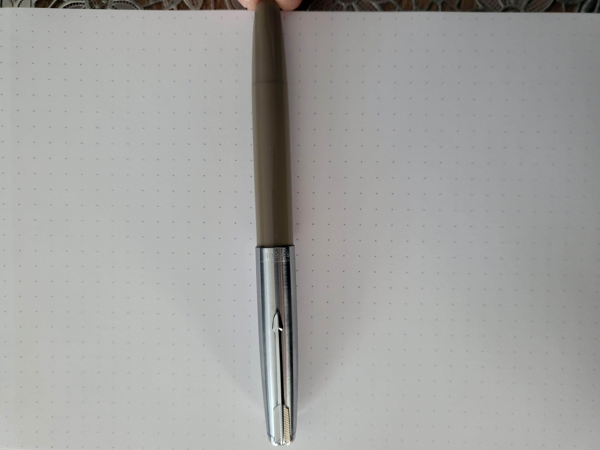
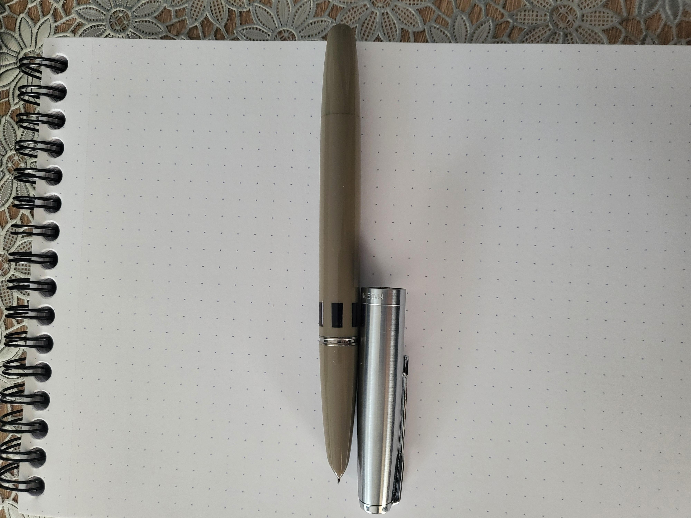
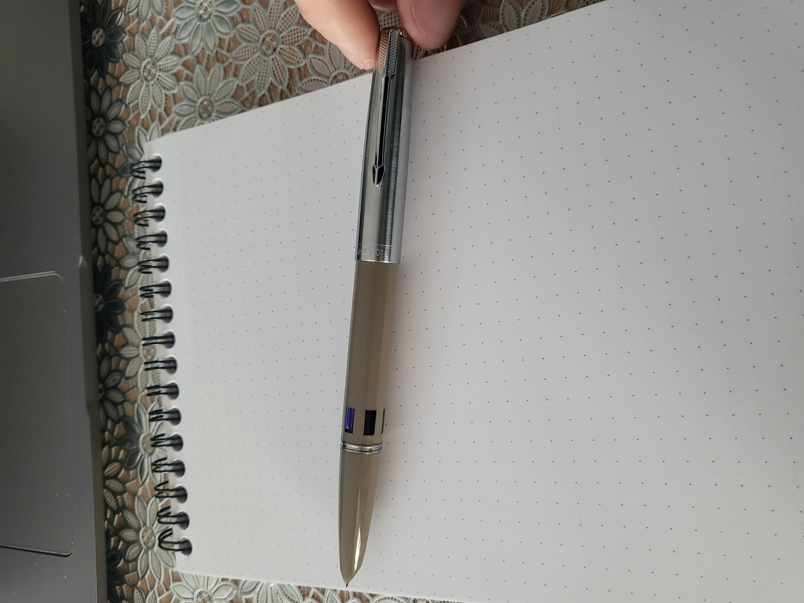
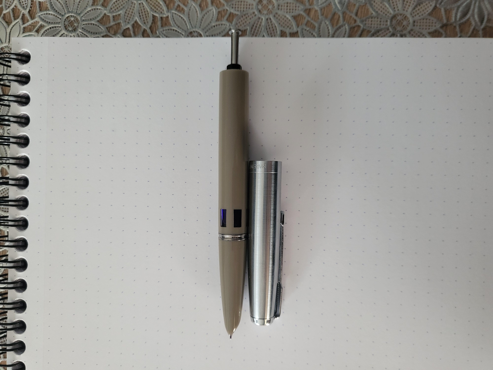

### Close-up on the hooded nib
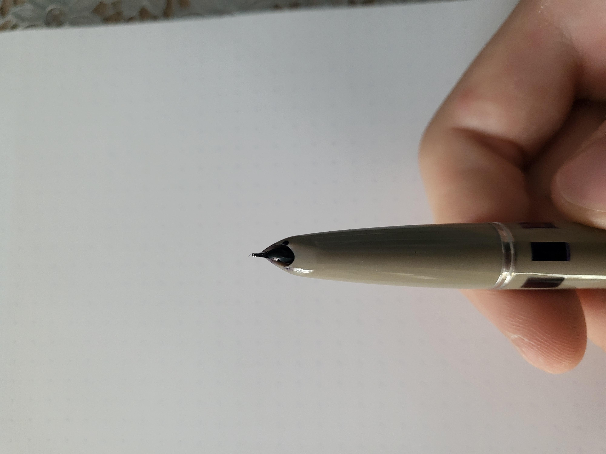
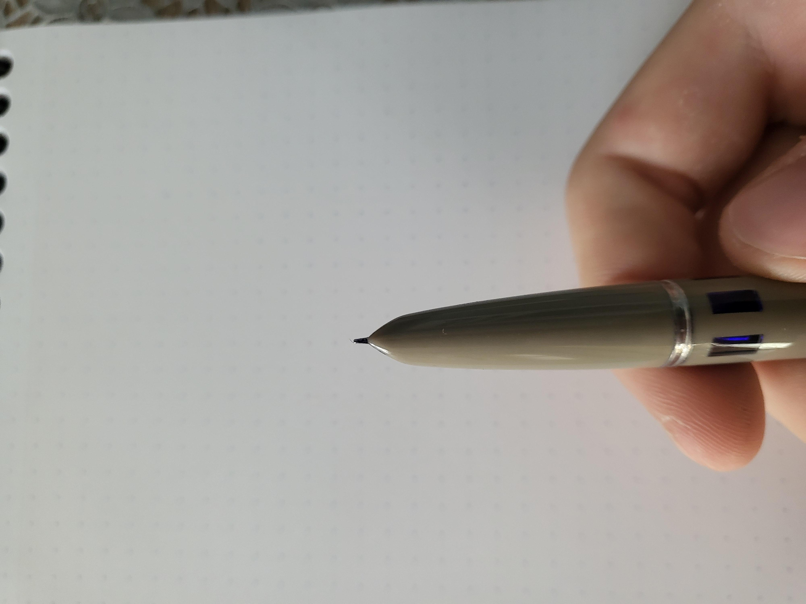

### Pen In Hand
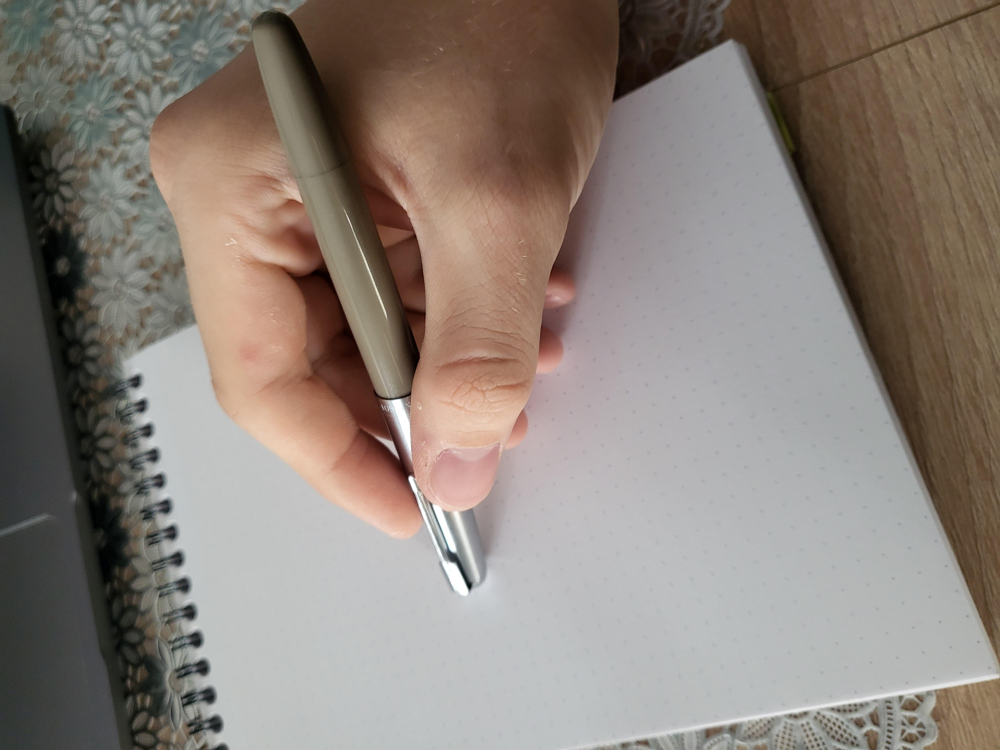
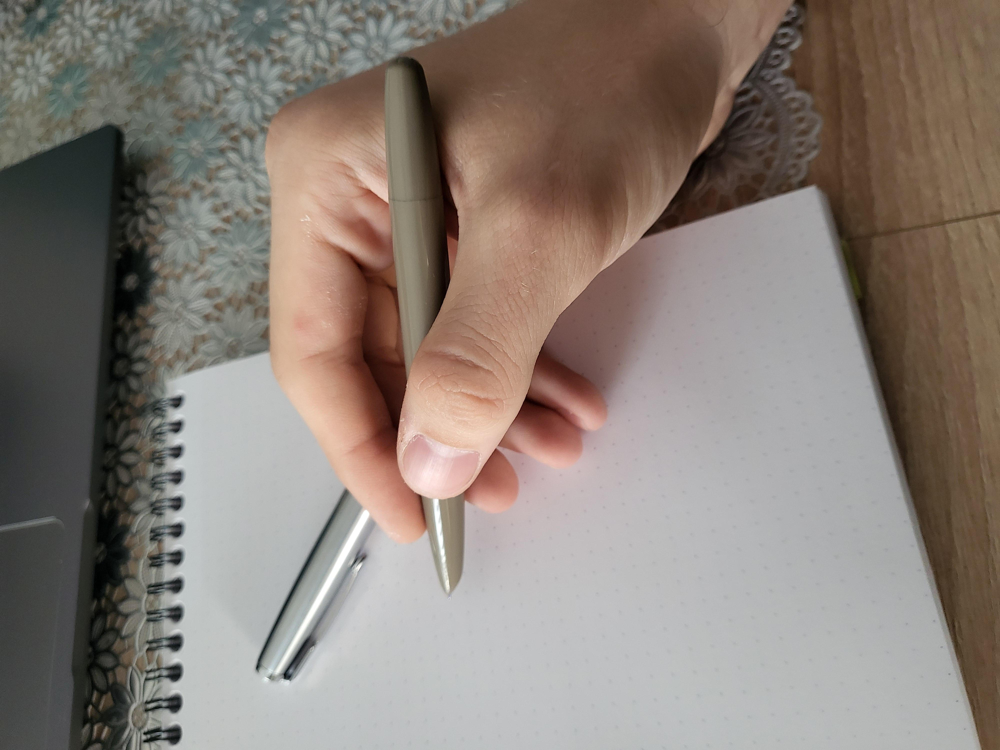
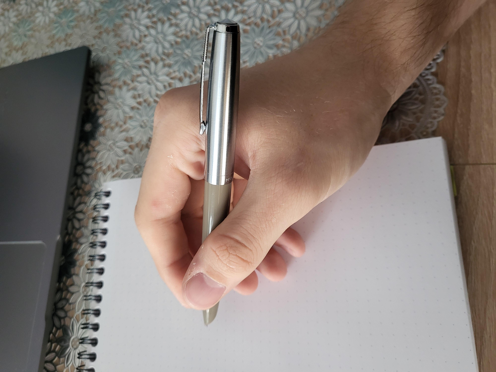

### Writing Sample
I am using **Diamine Sapphire** on Rhodia paper in the following samples.

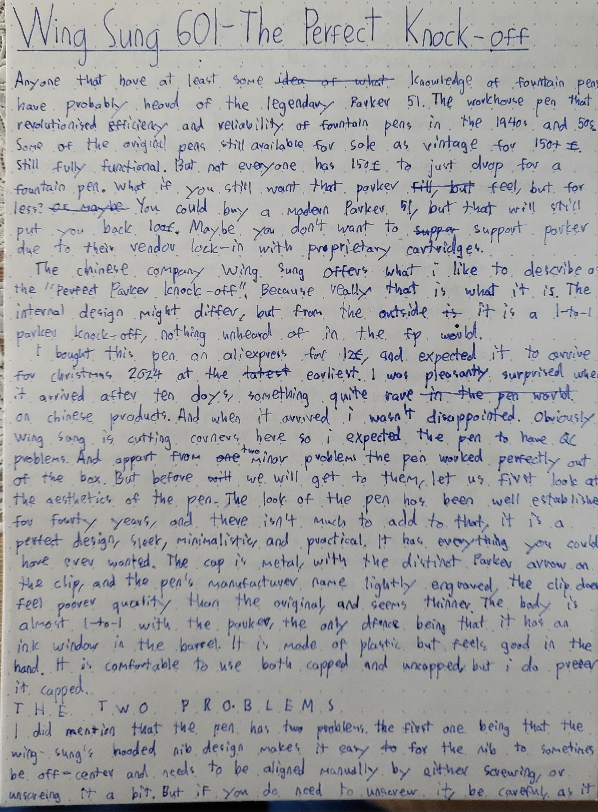
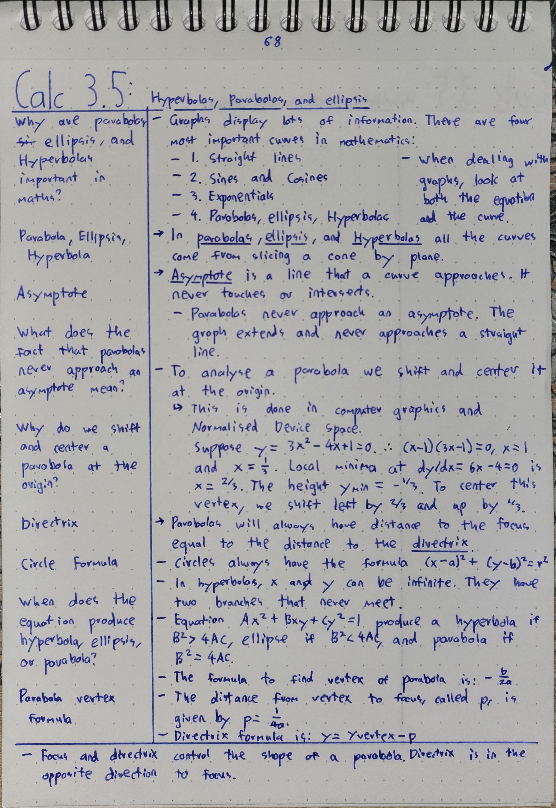
